# Feden

This project is a platform for renting houses. You can apply for existing announces or you can add yourself an announce. You can either rent a whole place or you can apply for a room to share the place with others.

## Requirements

For this project you will need:

- Node v12.18.0
- Yarn

## Project setup

To install the necessary libraries and dependencies you can use:

```
yarn install
```

To run this project in dev mode:

```
yarn dev
```

To build the project for production:

```
yarn build
```

## Key features

In this project you can find features like:

- Authentication system with JWT
- Advanced filtering that persists on page refresh
- Consuming REST API using Axios
- Routing using Vue Router
- State Management using Vuex
- Form Validation
- Generating statistics using ApexCharts
- Dynamic pagination for faster loading time

...and many more!

## Demos

<!-- Descriere + poza pentru fiecare functionalitate importanta -->

### Home Page

#### Most Popular Cities

Here you can see the most popular cities based on how many announces are currently available in that city.
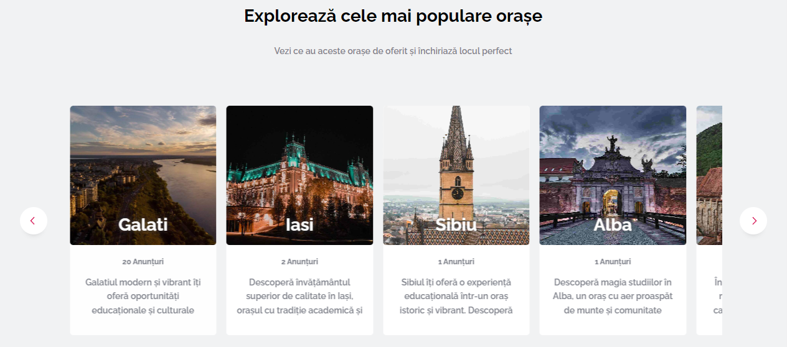

#### Most Searched Cities

You can see which cities are the most searched by users. The grid will update based on a search counter.
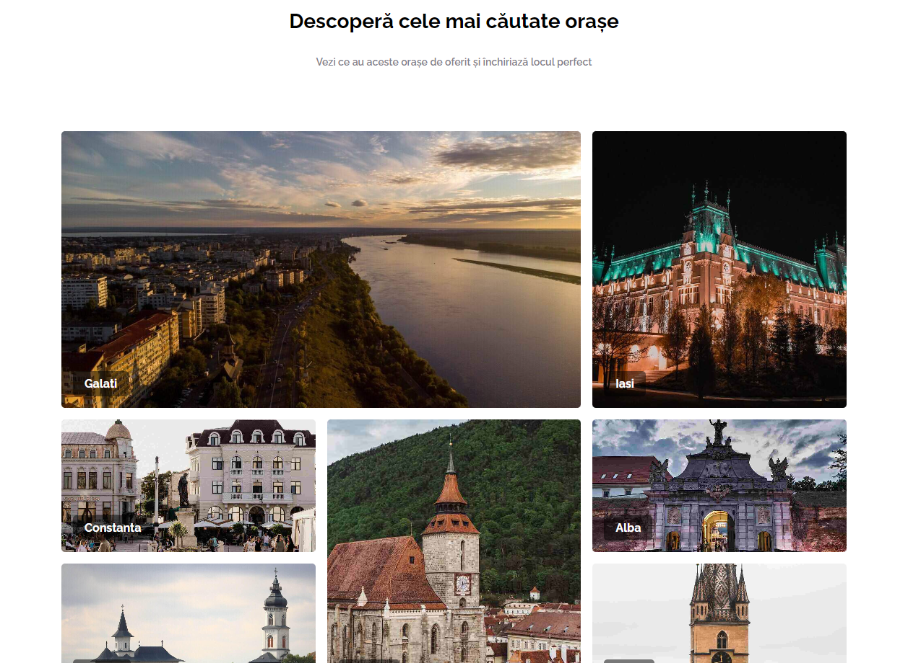

### Add Announce

A step by step process for adding a new announce. Each type of content needed for every new announce will have its own step. Since this has few steps, I won't include screenshots for every step but two steps bonded with each other.

#### Property Plan

You can set how many rooms and the surface your property have. The rooms are specially needed for adding the images for each one in the last step of adding the announce.
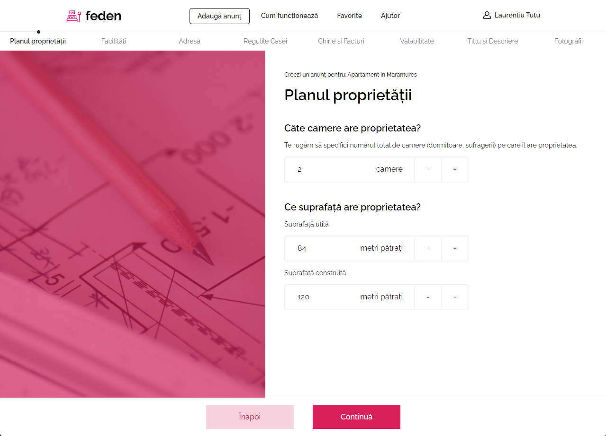

#### Add Images

Last step is adding the images for each individual room you have declared in the property plan.
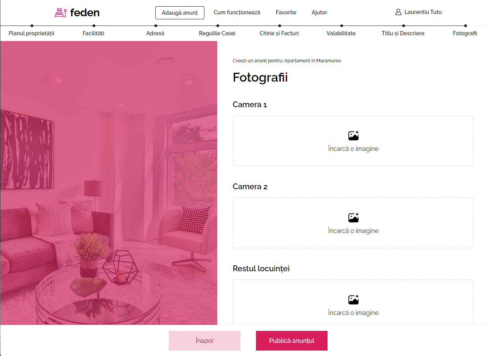

### Announces Page

#### Advanced Filters

Filters let you get more accurate results for your needs.
You can apply filters such as City, Availability and House Properties like house type, surface, rooms, house rules (non-smokers, pet-friendly) and many more.
You can also set a prefered budget range.
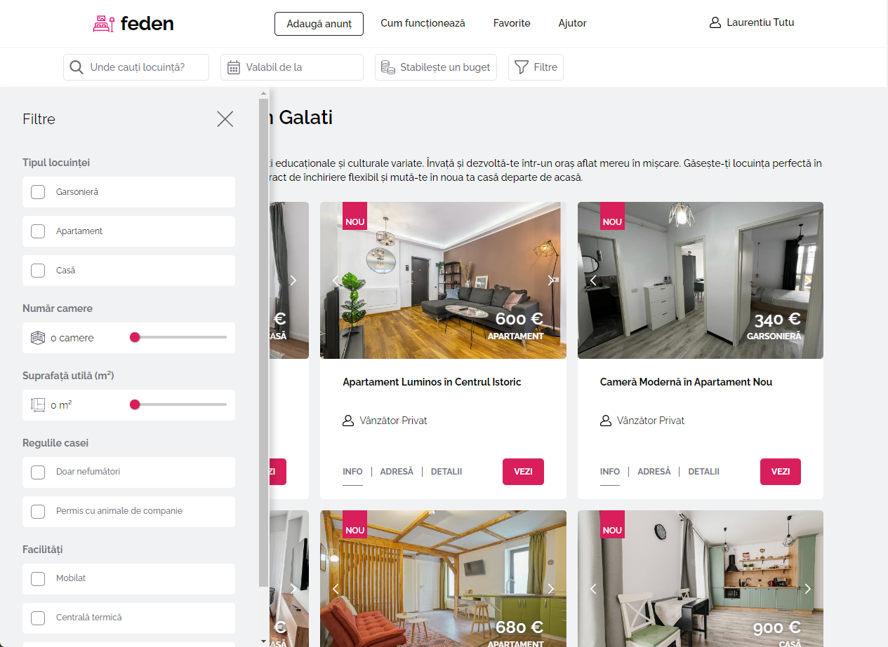

#### Dynamic Pagination

Announces will load in batches for each page resulting in a fast navigation. Reloading the page will also keep the current page number you currently are.
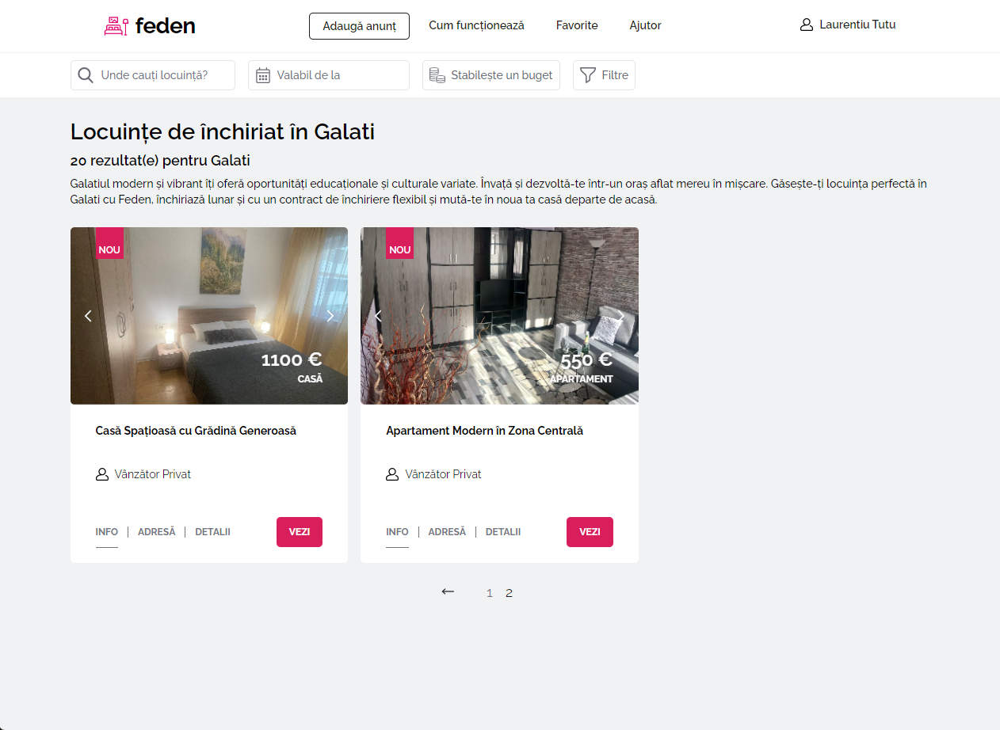

### Announce Page

#### House Gallery and Rental Options

In this section you can see main information about the place and also apply to rent the whole place or just a room. If the place already has applicants for rooms, you'll only see how many rooms available are left.
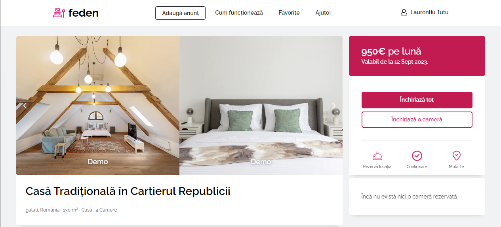

#### Details and Contact

You will be able to see the announce description and facilities of the place. You will also see who posted the announce and the contact person.
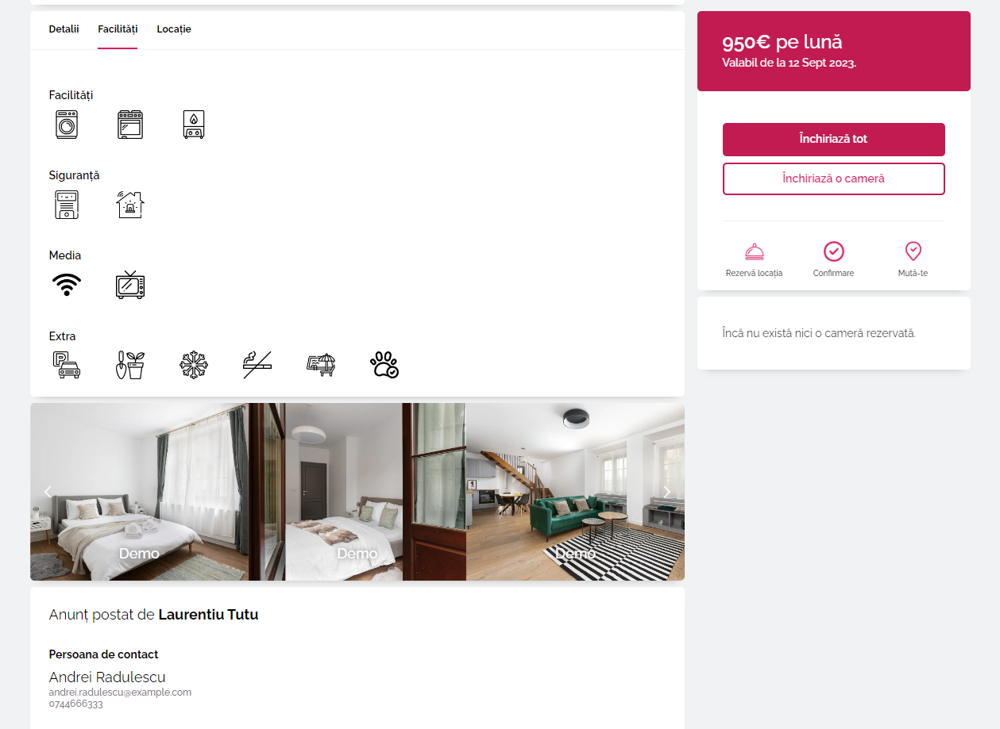

### MyAccount Page

#### Personal Information

This section will be useful for viewing and editing your personal information.

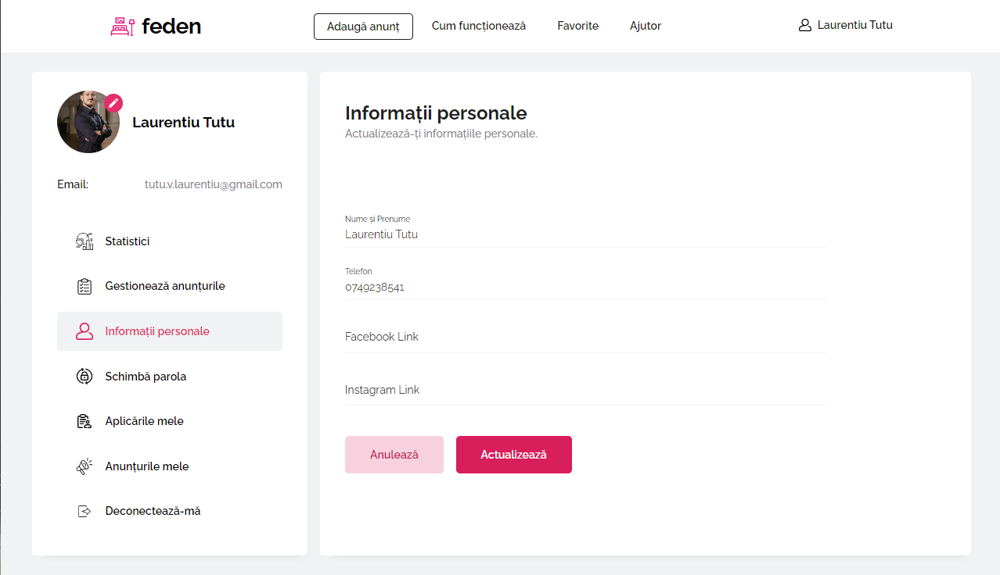

#### My Announces

You can manage your announces. You can see your applicants, approve or reject them and also disable or enable an announce.

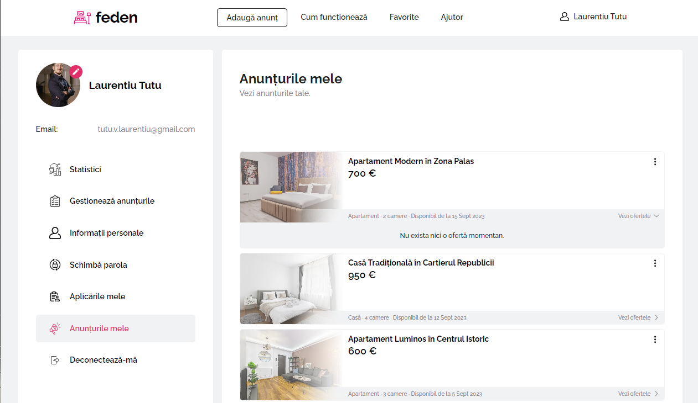

#### My Applications

You can manage your applications. You can see your applications status and cancel those you changed your mind about.

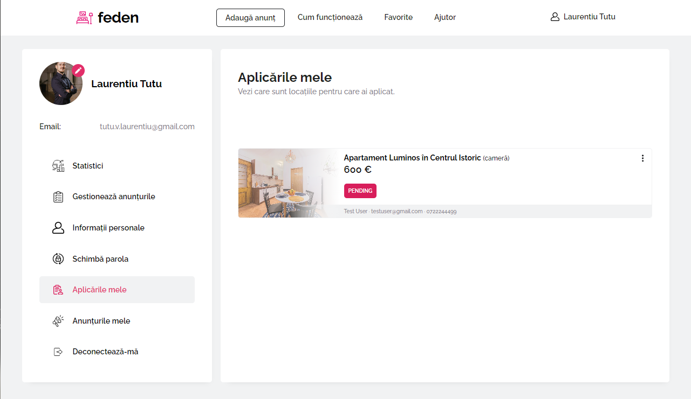

#### Manage Applications (admin only)

You can review and approve or reject applications added by other users before they go live on website.

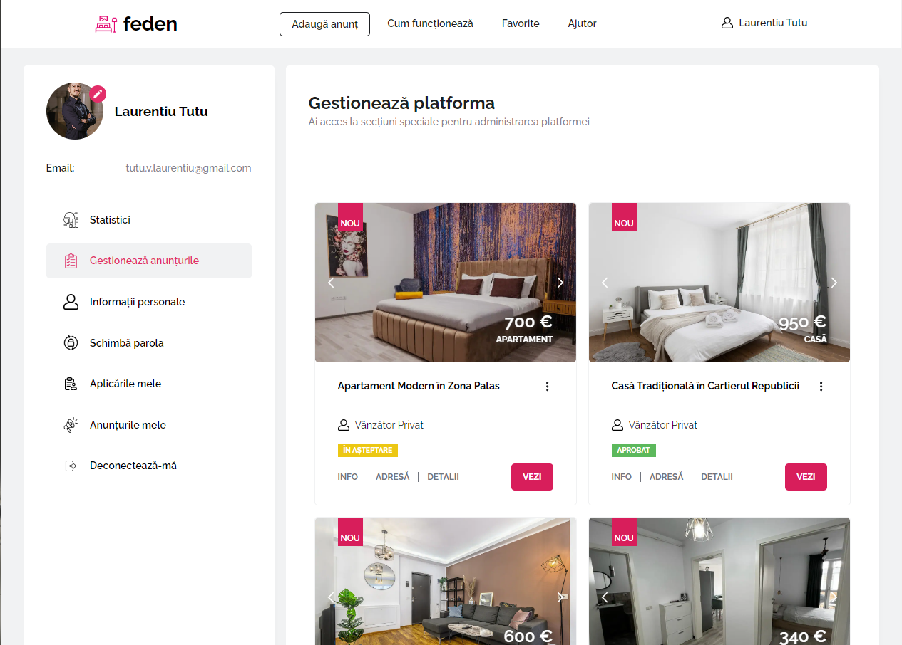

#### Statistics (admin only)

This section will help see certain statistics like the most searched cities and also which cities has the most announces.

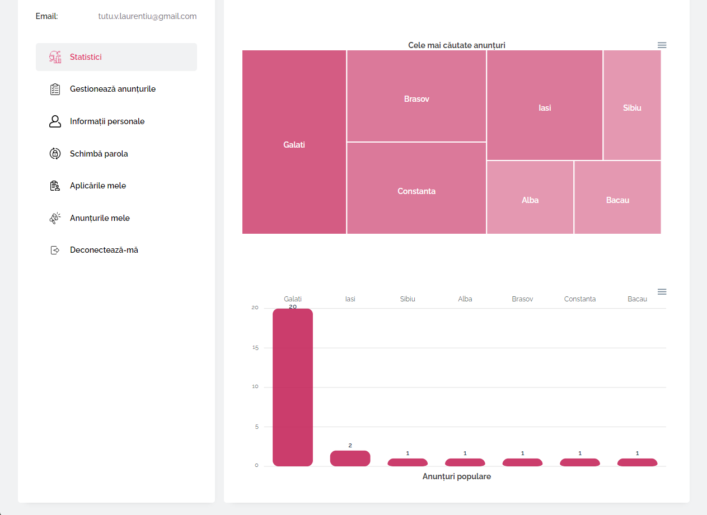
